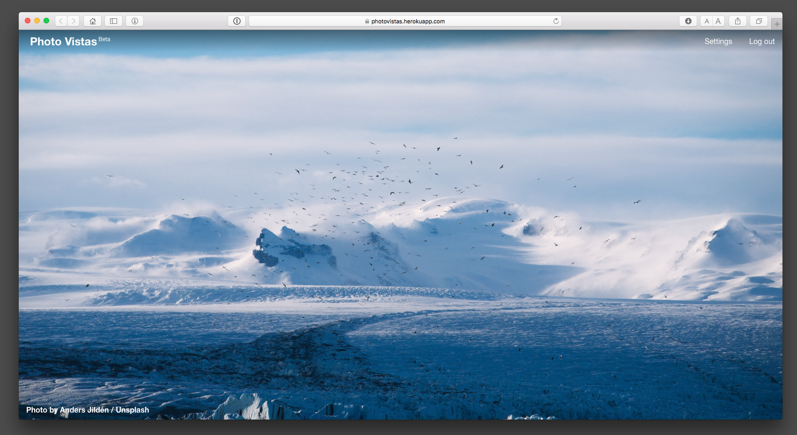

# Photo Vistas



[Photo Vistas](https://photovistas.com) uses the [Unsplash API](https://unsplash.com/developers) to provide your favorite Unsplash photos in new browser tabs.  Photo Vistas allows the user to create their own custom photo queue and associated homepage bookmark.  Photos are rotated daily at midnight.  

Photo Vistas is built with Ruby and the [Sinatra](http://www.sinatrarb.com) web development framework.  

*Photo Vistas was created as a project for the [Flatiron School's Online Web
Developer
Program](https://flatironschool.com/programs/online-web-developer-career-course/).
Additional information about the project can be found
[here](https://www.snsavage.com/blog/2016/creating_photo_vistas_with_sinatra.html).*

## Setup
Local development for Photo Vistas requires a few setup procedures.  Please submit a [bug report](https://github.com/snsavage/photovistas/issues) if these steps don't work for you.

You will need the following software:

* Git
* Ruby v2.3.1
* PostgreSQL

After cloning this GitHub repo, don't forget to run bundle install and run any database migrations.

```
	$ git clone https://github.com/snsavage/photovistas.git
	$ bundle install
	$ rake db:migrate
	$ rake db:migrate RACK_ENV=test
```

Photo Vistas uses the ```dotenv``` gem to manage environment variables.  These are primarily API keys for third-party services.  ```sample.env``` provides an outline of the variables that need to be set to run the web app.  The variables include:

```
SESSION_SECRET=secret		# This must be changed to a long random string for production.
UNSPLASH_ID					# Available from the Unsplash API
UNSPLASH_SECRET				# Available from the Unsplash API
UNSPLASH_REDIRECT_URI		# Available from the Unsplash API.  See below.
UNSPLASH_TEST_USERNAME		# Unsplash account for testing. See `Testing` below.
NEW_RELIC						# Available from New Relic.
```

In production a Google Analytics code should be set as ```GOOGLE_ANALYTICS```.  Also, Photo Vistas uses the Puma web server so ```MAX_THREADS``` and ```WEB_CONCURRENCY``` variables should be set to fit your production environment.

Finally, Photo Vistas provides a 'default queue' for users that don't have an Unsplash account.  The default queue points to a user that is set as the 'default' user.  To select a user, run ```rake default:change`` and provide a username when prompted.  The username provided should be for a user controlled by the site administrator. 

### How to Use the ```UNSPLASH_REDIRECT_URI```
The ```UNSPLASH_REDIRECT_URI``` should be set to one of three different values depending on the task.  

* Local Server - To run Photo Vistas locally, the value should be set as follows: ```http://<your-local-server-and-port>/unsplash/callback``` i.e. ```http://127.0.0.1:9393/unsplash/callback```.  This setting should allow the site to 'link' an Unsplash account with a locally served version of PhotoVistas.   
* Test Suite - The Unsplash API provides a callback URI for local tests.  See the testing section below for more information on setting up the test suite.
* Production Server - For the production server, the ```UNSPLASH_REDIRECT_URI``` should be set to the production server, i.e. ```http://<your-production-server>/unsplash/callback```.

## Testing
Photo Vistas has a test suite built with [rspec](http://rspec.info).  The test suite can be run with the commands:

```
	$ rspec				 # OR
	$ bundle exec rspec  # Depending on your system configuration. 
```

### Unsplash API Set Up for Testing
In order to run a passing test suite, an Unsplash authorization code first needs to be obtained.  Here are the steps:

1. Create a test user account at [Unsplash](https://unsplash.com).  While creating the test account, like a few photos and create two photo collections.  The test suite looks for these photos and collections.
2. Create an new application on the Unsplash API website.  Set ```UNSPLASH_REDIRECT_URI``` to the callback URI for local test provided by the Unsplash API website.  This will allow you to obtain an authorization code to use with the test suite.  
3. Start the local development web server.  Any web server should work, but ```shotgun``` and ```puma``` were used in development.  In the browser, navigate to the 'Sign up' page, create an account and check the option to 'Link You Unsplash Account'.  After clicking 'Sign up' Unsplash should prompt you to authorize the application.  After clicking authorize, a page with an authorization code should be displayed.  
4. From the console, run ```rake unsplash:token```.  When prompted provide the authorization code from step 3.  ```rake unsplash:token``` will complete the authorization process for the local instance of the app and save a copy of the authorization token to ```spec/token.json```.  The test suite will use this token when making calls to the Unsplash API. 

### Using the VCR Gem
Photo Vistas uses the [VCR](https://github.com/vcr/vcr) gem to record HTTP calls made by the app during testing.  ```VCR``` calls these recordings 'cassettes'.  The cassettes are not included in Photo Vistas git repo.  

The first time the test suite runs, ```VCR``` will record new cassettes specific to your Unsplash API key and test user.  While in development, Unsplash limits the number of API calls per hour to 50.  However, the Photo Vistas test suite requires more than 50 api calls to run fully.  ```VCR``` will raise an error for any tests that can't connect to the Unsplash API due to rate limiting.  When that happens remove any cassettes related to failed tests from the ```spec/cassettes``` directory and then rerun the test suite at the start of the next hour when the API limit starts back at 50.  

## Contributing

Bug reports and pull requests are welcome on GitHub at
[https://github.com/snsavage/photovistas/issues](https://github.com/snsavage/photovistas/issues).
Please read the [Contributing Guide](./CONTRIBUTING.md).  This project is
intended to be a safe, welcoming space for collaboration, and contributors are
expected to adhere to the [Code of Conduct](./CODE_OF_CONDUCT.md).

## Questions?
Please contact [scott@photovistas.com](mailto: scott@photovistas.com)

## License

Photo Vistas is released on the [MIT License](./LICENSE).


  
